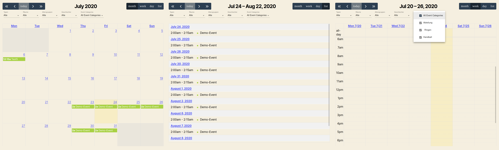
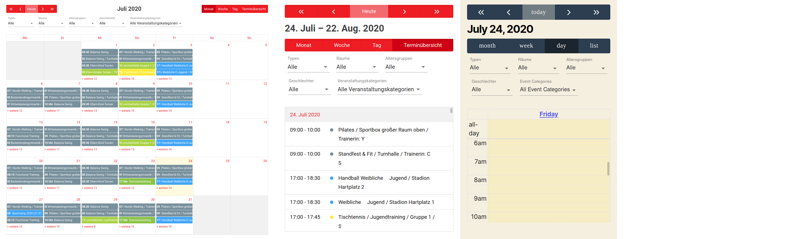

## GB FullCalendar


- Contributors:      August Oberhauser
- Tags:              block, fullcalendar, react
- Requires at least: 5.3.2
- Tested up to:      5.7
- Stable tag:        0.2.1
- Requires PHP:      7.0.0
- License:           GPL-3.0-or-later
- License URI:       https://www.gnu.org/licenses/gpl-3.0.html

GB FullCalendar is a Gutenberg block for displaying events. It's build on the popular WP FullCalendar plugin.

## Description

Thanks to the Gutenberg-Blocks since the end of 2018, it has become incredibly easy to add and layout your blocks in a 
visual way, but still can be used with Shortcodes, too.

### Features

- Month / Week / Day and List views
- Filter by taxonomies, such as category, tag etc.
- Supports custom post types and custom taxonomies
- Integrates seamlessly with [Events Manager](http://wordpress.org/extend/plugins/events-manager/)
- Customize [FullCalendar settings](https://fullcalendar.io/docs)
- Tooltips
- Custom [themes and styles](./docs/Themes-Styles.md)
- Supports IE 11
- Migrating WP FullCalendar settings

### Credits

Thanks to [Marcus Sykes](https://profiles.wordpress.org/netweblogic/) for his previous work on WP Fullcalendar, which is partially integrated here.

## Installation

1. Upload the plugin files to the `/wp-content/plugins/gb-fullcalendar` directory, or install the plugin through the WordPress plugins screen directly.
2. Activate the plugin through the 'Plugins' screen in WordPress

## Usage

<b>
    Note: There's no guarantee that GB FullCalendar works simultaneously with WP
    FullCalendar. It's recommended to only enable one plugin at the same time!
</b>

### Gutenberg Block

Simply add the Gutenberg Block <b>GB FullCalendar</b>, which is located under the Widgets section. 
When you select your block, you can adjust the block-settings in the sidebar.

### Shortcode

You are able to use the <code>[fullcalendar]</code> shortcode in one of your posts or pages, too.

The calendar can be customized

- with [Event search attributes](https://wp-events-plugin.com/documentation/event-search-attributes/) of Events Manager.
    - Note that some attributes can differ from its internal representation in Events Manager. 
      E.g.`category` is a synonym for the taxonomy `event-categories`
- with [FullCalendar settings](https://fullcalendar.io/docs). 
    - Convert the keys with camel case to lowercase words separated with an underscore. 
    - Add the prefix `fc_`.
    - Example: 
    [<code>initialView: "listCustom"</code>](https://fullcalendar.io/docs/initialView) is converted to 
    `[fullcalendar fc_initial_view="listCustom"]`.     
- by declaring your default [<code>taxonomy terms</code>](https://developer.wordpress.org/themes/basics/categories-tags-custom-taxonomies/#custom-taxonomies). 
     - Specify value either via the term id or the term slug.          

```
[fullcalendar 
  category="concert, cinema, 11, theatre" 
  event-tags="mytag"
  search="Demo"
  fc_event_display="auto"
  your_custom_taxonomy_slug="your_custom_term_slug, another_custom_term_id"]
```

### Taxonomies and Terms

You can define your own [taxonomies and terms](./docs/EM-Taxonomies-Terms.md) in order to categorize your events more precisely.

### Themes and Styles

See documentation for [themes and styles](./docs/Themes-Styles.md)

## Frequently Asked Questions (FAQ)

None yet.

## Screenshots




## Changelog

See [changelog file](./CHANGELOG.md).

## Contribution

You are invited to help in form of Merge-Requests or proposing issues with the expected solutions.

To develop, install the packages via `yarn install`. Then start webpack compiling via `yarn start`.
To build files for production run `yarn build`.
To build a plugin file run `yarn zip-snap`. The zip file will be saved in the `dist` folder.

The code is written as ESNext, but uses Babel and Webpack to provide compatibility to ancient browsers.

**The plugin is free to use. We are not liable for any damage caused by using the plugin!**
